# Learn EMOS

> **Public EMOS Beta v1.0 learning center**  
> Explore the product journey without signing in to EMOS.

[Launch EMOS](https://emos-modernization.ai.studio) · [Open the complete video library](https://drive.google.com/drive/folders/1ONwIDuVpKqu3DJzmHgzrtYTeJaOUXqQ1?usp=drive_link) · [Return to the project README](../README.md)

The Google Drive folder is the canonical video library for this beta. Open the library and select the filename shown beneath each lesson. The videos contain demonstration data only; never record or upload customer information, credentials, tokens, or production secrets.

## Recommended learning path

For a concise end-to-end view, watch the introduction followed by **F10 → F11 → F12 → F03 → F04 → F19**. This sequence moves from portfolio discovery through Enterprise DNA, explainable 6R decisions, wave planning, and mobilization readiness.

## Start here

| Preview | Lesson |
| :--- | :--- |
| [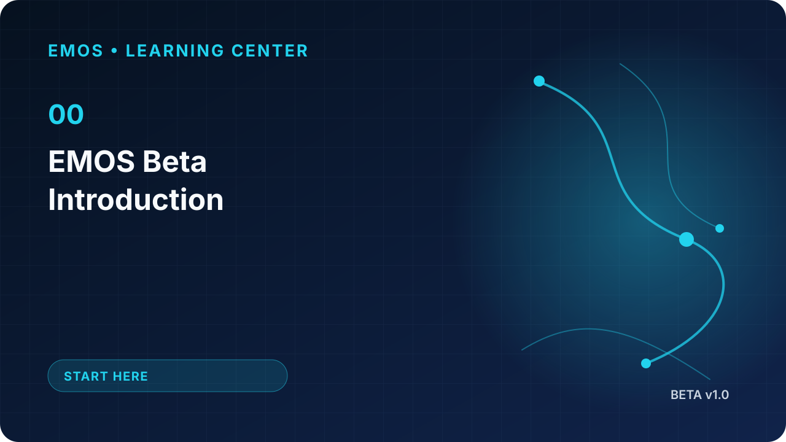](demo/EMOS-Beta-Introduction.mp4) | **00 · EMOS Beta Introduction** Understand the enterprise problem, the modernization journey, the implemented beta scope, the Google Cloud architecture, and the future roadmap. `Start Here` `Beta v1.0` `4:17` [Watch MP4](demo/EMOS-Beta-Introduction.mp4) · [WebVTT subtitles](demo/EMOS-Beta-Introduction.vtt) · [SRT subtitles](demo/EMOS-Beta-Introduction.srt) |
| [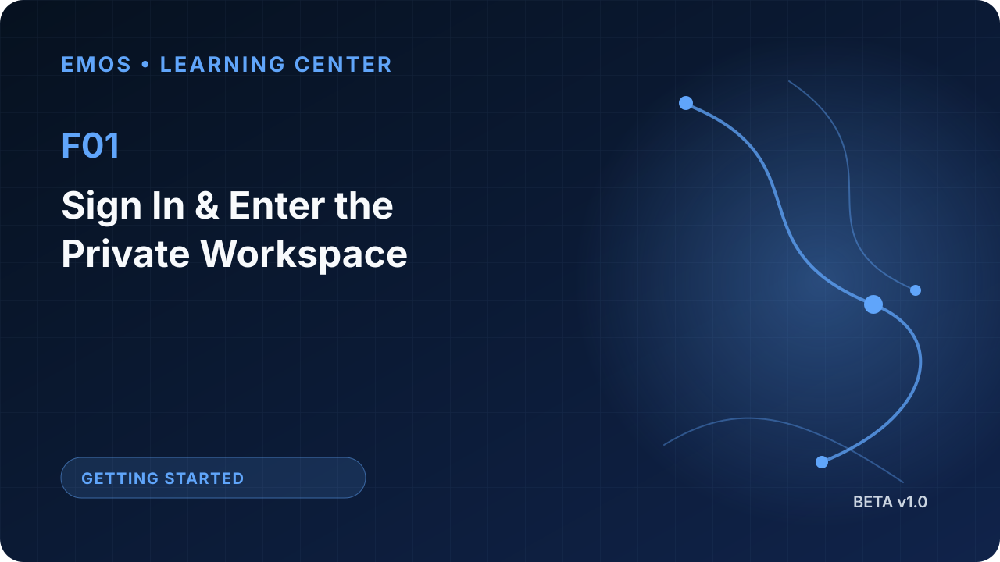](https://drive.google.com/drive/folders/1ONwIDuVpKqu3DJzmHgzrtYTeJaOUXqQ1?usp=drive_link) | **F01 · Sign in and enter the private workspace** See the Firebase Google Sign-In entry point and the owner-bound EMOS workspace. `Getting Started` `Authentication` `Beta v1.0` File: `F01-sign-in-enter-the-private-workspace.mp4` |
| [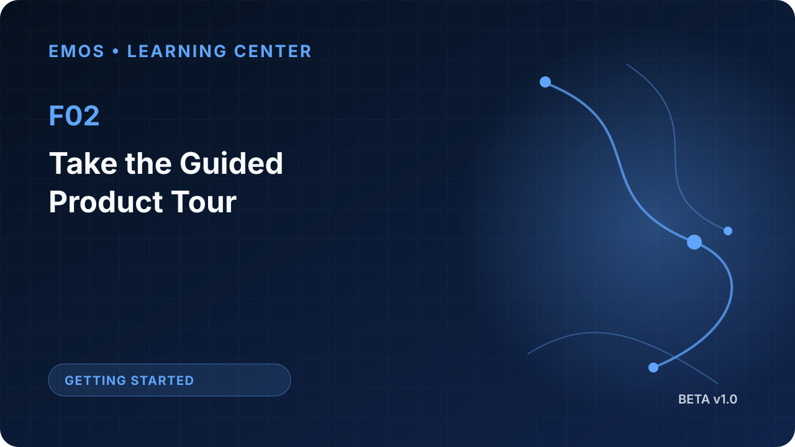](https://drive.google.com/drive/folders/1ONwIDuVpKqu3DJzmHgzrtYTeJaOUXqQ1?usp=drive_link) | **F02 · Take the guided product tour** Orient yourself to the beta experience and the major product areas. `Getting Started` `Product Tour` `Beta v1.0` File: `F02-take-the-guided-product-tour.mp4` |

## Assess and decide

| Preview | Lesson |
| :--- | :--- |
| [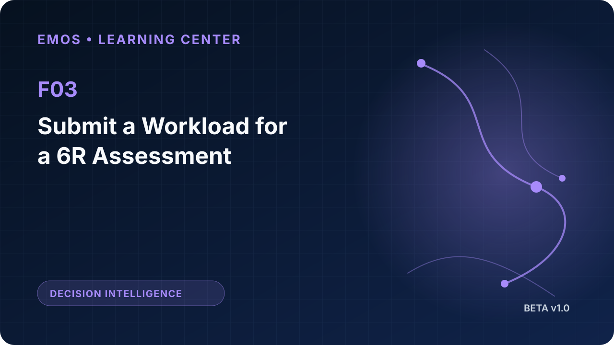](https://drive.google.com/drive/folders/1ONwIDuVpKqu3DJzmHgzrtYTeJaOUXqQ1?usp=drive_link) | **F03 · Submit a workload for a 6R assessment** Send structured workload evidence through the authenticated assessment workflow. `Decision Intelligence` `Canonical 6R` `Beta v1.0` File: `F03-submit-a-workload-for-a-6r-assessment.mp4` |
| [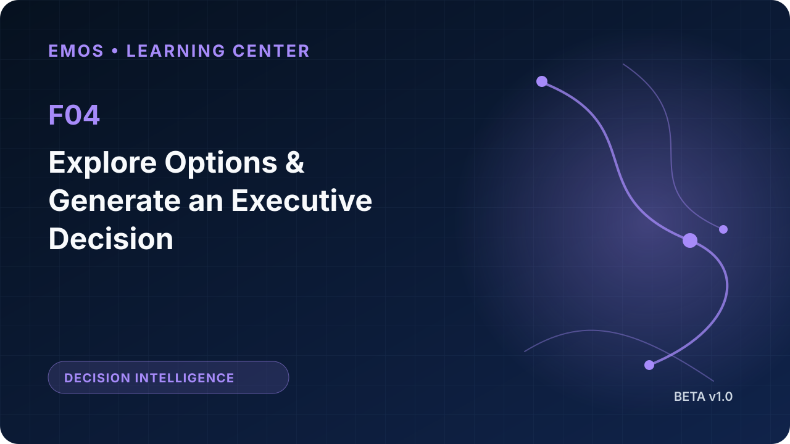](https://drive.google.com/drive/folders/1ONwIDuVpKqu3DJzmHgzrtYTeJaOUXqQ1?usp=drive_link) | **F04 · Explore options and generate an executive decision** Review the recommended disposition, rationale, alternatives, risks, and decision output. `Decision Intelligence` `Explainability` `Beta v1.0` File: `F04-explore-options-generate-an-executive-decision.mp4` |
| [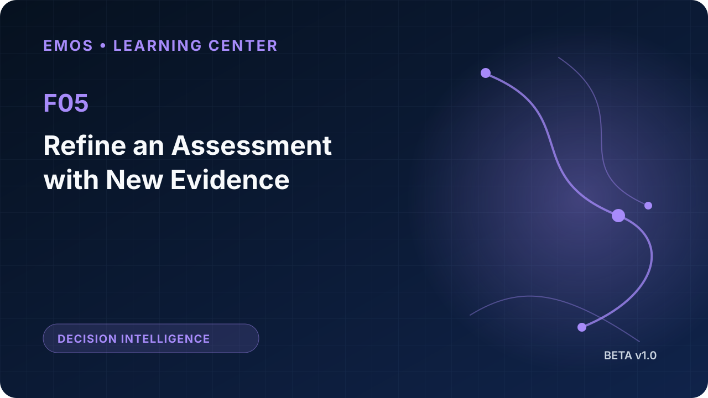](https://drive.google.com/drive/folders/1ONwIDuVpKqu3DJzmHgzrtYTeJaOUXqQ1?usp=drive_link) | **F05 · Refine an assessment with new evidence** Use a multi-turn follow-up to improve the recommendation as evidence changes. `Decision Intelligence` `Gemini Follow-up` `Beta v1.0` File: `F05-refine-an-assessment-with-new-evidence.mp4` |

## Trust and governance

| Preview | Lesson |
| :--- | :--- |
| [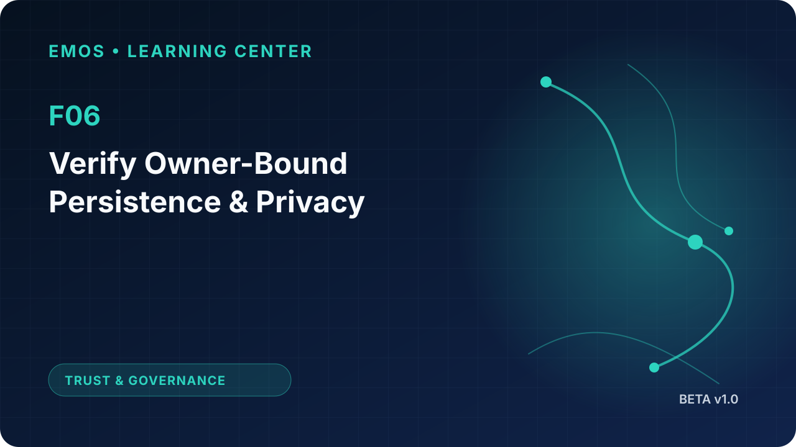](https://drive.google.com/drive/folders/1ONwIDuVpKqu3DJzmHgzrtYTeJaOUXqQ1?usp=drive_link) | **F06 · Verify owner-bound persistence and privacy** Understand how authenticated user data remains isolated in Cloud Firestore. `Trust & Governance` `Firestore` `Beta v1.0` File: `F06-verify-owner-bound-persistence-privacy.mp4` |
| [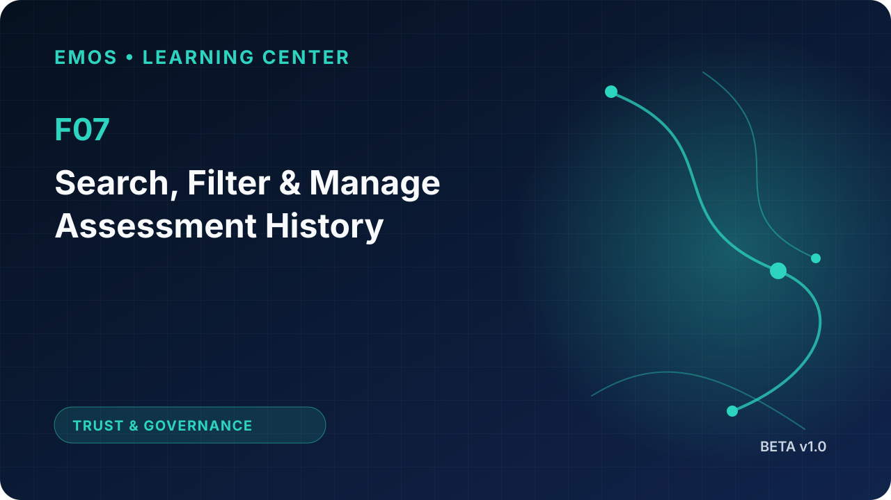](https://drive.google.com/drive/folders/1ONwIDuVpKqu3DJzmHgzrtYTeJaOUXqQ1?usp=drive_link) | **F07 · Search, filter, and manage assessment history** Find and revisit persisted modernization assessments. `Trust & Governance` `History` `Beta v1.0` File: `F07-search-filter-manage-assessment-history.mp4` |
| [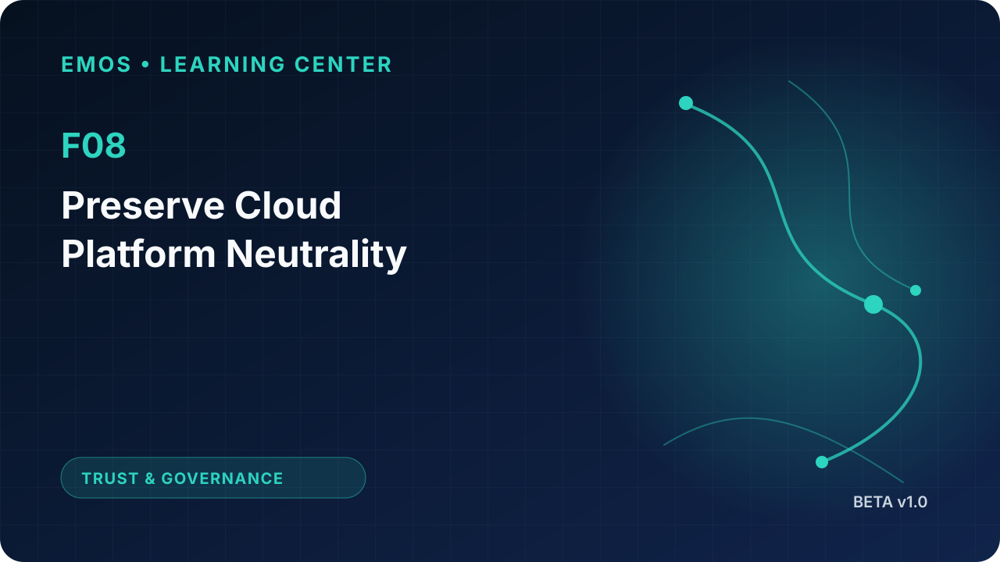](https://drive.google.com/drive/folders/1ONwIDuVpKqu3DJzmHgzrtYTeJaOUXqQ1?usp=drive_link) | **F08 · Preserve cloud-platform neutrality** See how EMOS avoids inventing a hyperscaler choice when target-state evidence is missing. `Trust & Governance` `Vendor Neutrality` `Beta v1.0` File: `F08-preserve-cloud-platform-neutrality.mp4` |
| [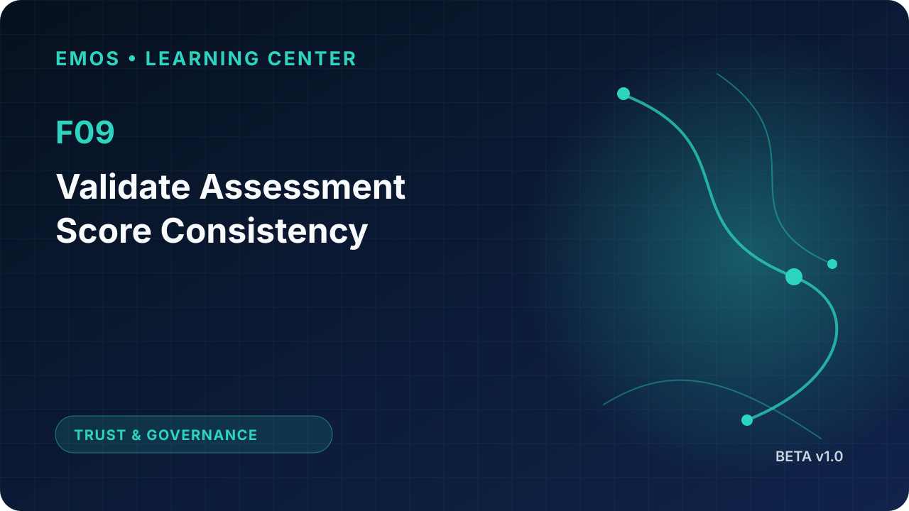](https://drive.google.com/drive/folders/1ONwIDuVpKqu3DJzmHgzrtYTeJaOUXqQ1?usp=drive_link) | **F09 · Validate assessment-score consistency** Compare evidence completeness, recommendation confidence, and decision readiness without conflating them. `Trust & Governance` `Consistency` `Beta v1.0` File: `F09-validate-assessment-score-consistency.mp4` |

## Portfolio and Enterprise DNA

| Preview | Lesson |
| :--- | :--- |
|  | **F10 · Explore the sample enterprise portfolio** Start with representative enterprise workloads and modernization signals. `Portfolio & DNA` `Discovery` `Beta v1.0` File: `F10-explore-the-sample-enterprise-portfolio.mp4` |
| [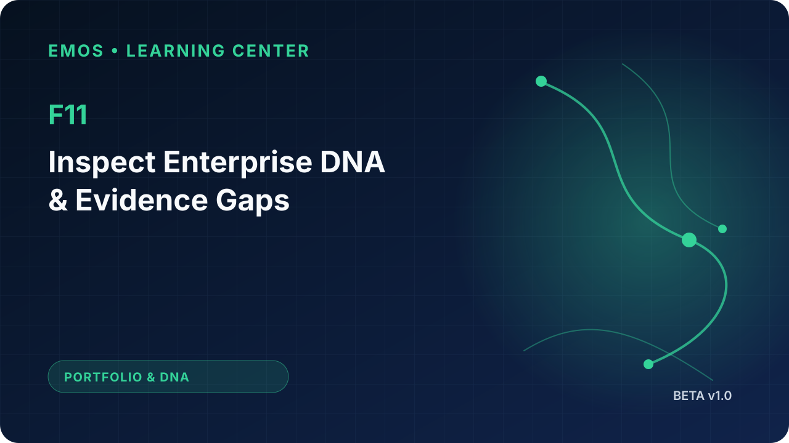](https://drive.google.com/drive/folders/1ONwIDuVpKqu3DJzmHgzrtYTeJaOUXqQ1?usp=drive_link) | **F11 · Inspect Enterprise DNA and evidence gaps** Review known, incomplete, and missing evidence across the six DNA dimensions. `Portfolio & DNA` `Evidence Gaps` `Beta v1.0` File: `F11-inspect-enterprise-dna-evidence-gaps.mp4` |
| [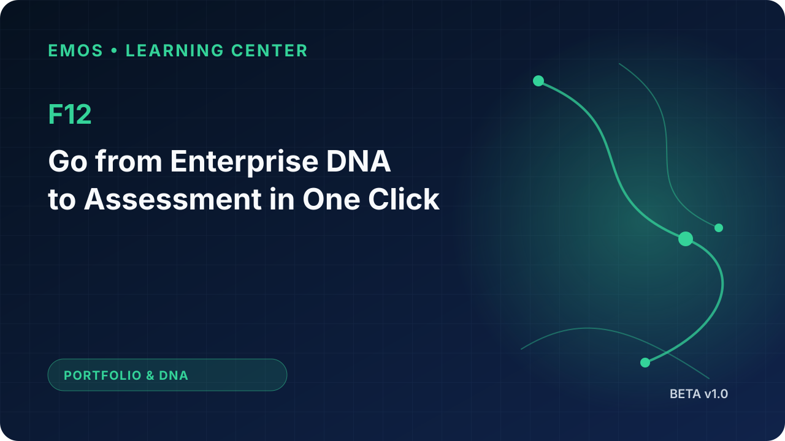](https://drive.google.com/drive/folders/1ONwIDuVpKqu3DJzmHgzrtYTeJaOUXqQ1?usp=drive_link) | **F12 · Go from Enterprise DNA to assessment in one click** Carry structured context directly into assessment without re-entering evidence. `Portfolio & DNA` `Guided Flow` `Beta v1.0` File: `F12-go-from-enterprise-dna-to-assessment-in-one-click.mp4` |
| [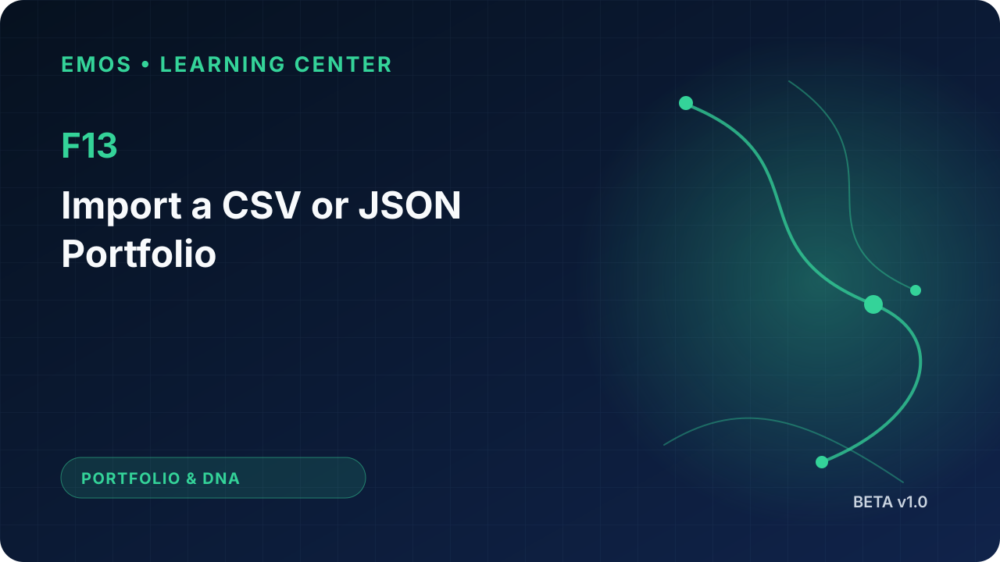](https://drive.google.com/drive/folders/1ONwIDuVpKqu3DJzmHgzrtYTeJaOUXqQ1?usp=drive_link) | **F13 · Import a CSV or JSON portfolio** Bring a controlled workload inventory into EMOS with schema and input-safety checks. `Portfolio & DNA` `BYOP` `Beta v1.0` File: `F13-import-a-csv-or-json-portfolio.mp4` |
| [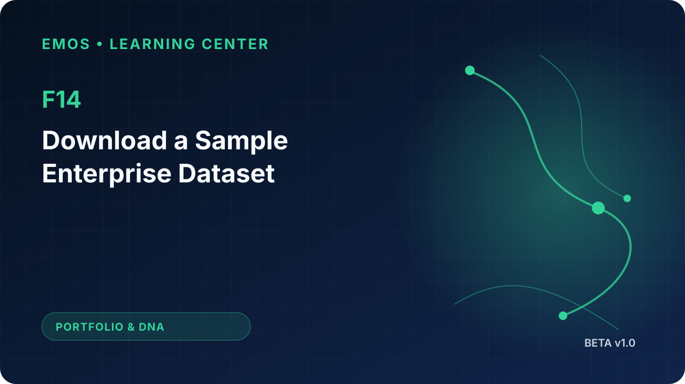](https://drive.google.com/drive/folders/1ONwIDuVpKqu3DJzmHgzrtYTeJaOUXqQ1?usp=drive_link) | **F14 · Download a sample enterprise dataset** Use a benchmark portfolio to evaluate the import and assessment experience. `Portfolio & DNA` `Sample Data` `Beta v1.0` File: `F14-download-a-sample-enterprise-dataset.mp4` |
| [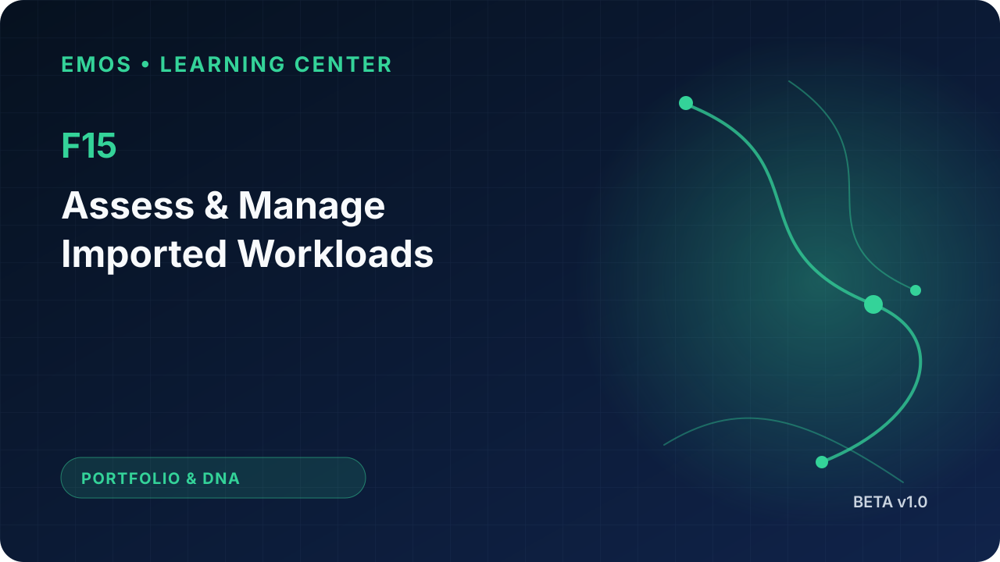](https://drive.google.com/drive/folders/1ONwIDuVpKqu3DJzmHgzrtYTeJaOUXqQ1?usp=drive_link) | **F15 · Assess and manage imported workloads** Move imported portfolio records through Enterprise DNA and 6R assessment. `Portfolio & DNA` `BYOP` `Beta v1.0` File: `F15-assess-manage-imported-workloads.mp4` |

## Product experience and security

| Preview | Lesson |
| :--- | :--- |
| [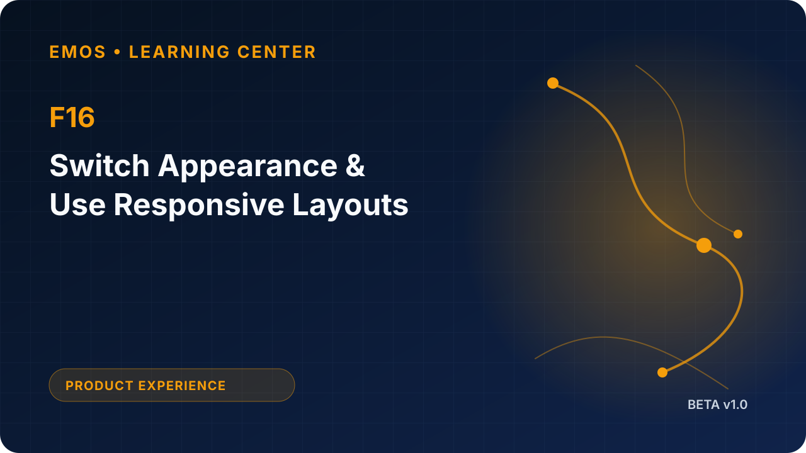](https://drive.google.com/drive/folders/1ONwIDuVpKqu3DJzmHgzrtYTeJaOUXqQ1?usp=drive_link) | **F16 · Switch appearance and use responsive layouts** Explore light, dark, and system themes across responsive product layouts. `Product Experience` `Accessibility` `Beta v1.0` File: `F16-switch-appearance-use-responsive-layouts.mp4` |
| [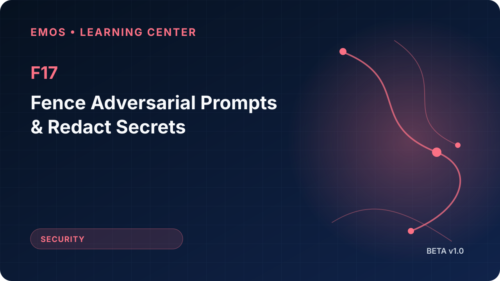](https://drive.google.com/drive/folders/1ONwIDuVpKqu3DJzmHgzrtYTeJaOUXqQ1?usp=drive_link) | **F17 · Fence adversarial prompts and redact secrets** See the input guardrails and output-redaction controls applied around Gemini. `Security` `AI Guardrails` `Beta v1.0` File: `F17-fence-adversarial-prompts-redact-secrets.mp4` |
| [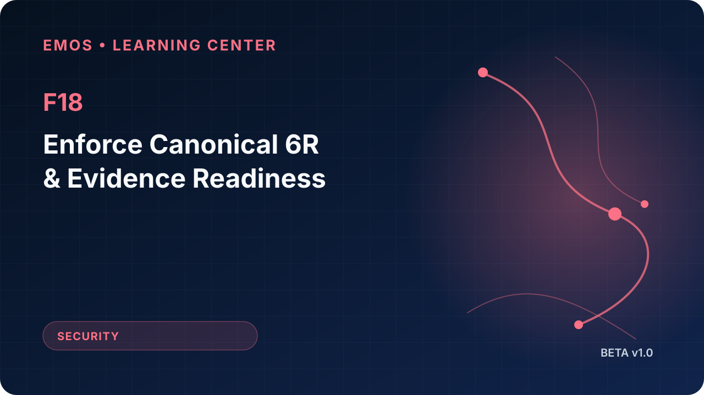](https://drive.google.com/drive/folders/1ONwIDuVpKqu3DJzmHgzrtYTeJaOUXqQ1?usp=drive_link) | **F18 · Enforce canonical 6R and evidence readiness** Review deterministic taxonomy repair and evidence-gated readiness behavior. `Security` `Release Controls` `Beta v1.0` File: `F18-enforce-canonical-6r-evidence-readiness.mp4` |

## Plan and mobilize

| Preview | Lesson |
| :--- | :--- |
| [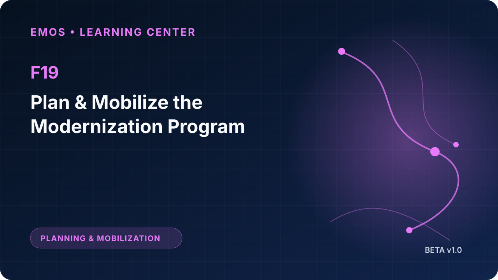](https://drive.google.com/drive/folders/1ONwIDuVpKqu3DJzmHgzrtYTeJaOUXqQ1?usp=drive_link) | **F19 · Plan and mobilize the modernization program** Translate assessed workloads into preliminary modernization waves, readiness actions, and an executive decision pack. `Planning & Mobilization` `Wave Planning` `Beta v1.0` File: `F19-plan-mobilize-the-modernization-program.mp4` |

## Beta scope note

The videos document capabilities available in EMOS Beta v1.0. Automated live CMDB discovery, organization-wide RBAC, disposition-specific execution agents, autonomous validation, benefit-realization tracking, and marketplace distribution remain future scope unless explicitly identified otherwise.

